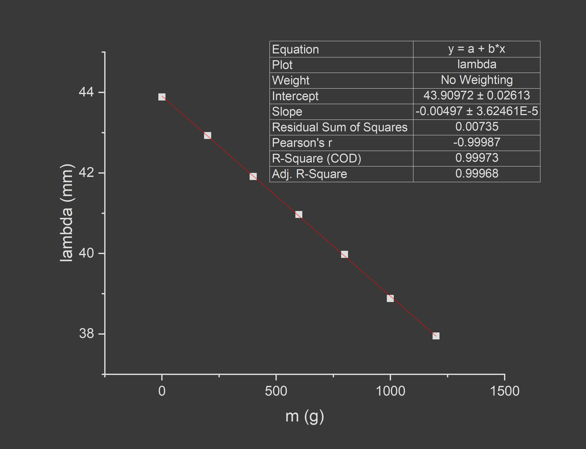

# 测量金属的杨氏模量实验报告
## *师翔宇 2500011575*

实验室给出$g=9.801m/s^2$

## 一、CCD法

1. 质量

| i | 1 | 2 | 3 | 4 | 5 | 6 | 7 | 8 | 9 |
|---|---|---|---|---|---|---|---|---|---|
| m/g|200.06|199.68|199.74|200.15|200.39|200.01|200.08|200.05|200.14|

$m_0 = 0.05 g$

$e=0.005g$
$\qquad \sigma_{电子天平} = 0.00288675g$
$\qquad$ $\sigma_{avrg} = 0.214126g$

$m \pm \sigma_m = 199.98 \pm 0.21g$

2. 直径

| i | 1 | 2 | 3 | 4 | 5 | 6 | 7 | 8 | 9 | 10 |
|---|---|---|---|---|---|---|---|---|---|---|
| D/mm|0.329|0.322|0.325|0.324|0.325|0.326|0.326|0.329|0.330|0.328|

$D_0 = 0.005mm$

$e=0.004mm$
$\qquad \sigma_{千分尺} = 0.0023094mm$
$\qquad$ $\sigma_{avrg} = 0.00254733mm$

$D \pm \sigma_D = 0.321 \pm 0.003mm$

3. 金属丝长度

$L = 78.00cm$
$\qquad e=0.15cm$

$L \pm \sigma_L = 78.00 \pm 0.09$

4. 伸长量

| i | m/g | $r_i/mm$ | $r_i \prime/mm$ | $\bar r_i/mm$ |
|---|---|---|---|---|
| 0 | 0.00 | 2.03 | 2.00 | 2.015 |
| 1 | 200.01 | 2.21 | 2.29 | 2.250 |
| 2 | 399.64 | 2.42 | 2.40 | 2.410 |
| 3 | 599.33 | 2.58 | 2.55 | 2.565 |
| 4 | 799.43 | 2.63 | 2.65 | 2.640 |
| 5 | 999.77 | 2.82 | 2.82 | 2.820 |
| 6 | 1199.73 | 2.98 | 2.96 | 2.970 |
| 7 | 1399.76 | 3.08 | 3.10 | 3.090 |
| 8 | 1599.76 | 3.20 | 3.20 | 3.200 |
| 9 | 1799.85 | 3.31 | 3.31 | 3.310 |

将最小分度值0.05mm视为允差，$\sigma_{CCD}=0.0288675mm$

5. 逐差法数据处理

注意到i=0的数据线性不佳，可能是因为金属丝有弯折，故舍去，从i=1的数据开始处理

| i | 1 | 2 | 3 | 4 |
|---|---|---|---|---|
| $\delta{\bar r_i}/mm$ | 0.570 | 0.560 | 0.525 | 0.560 |
| $\delta{L_i}/mm$ | 0.1425 | 0.14 | 0.13125 | 0.14 |
 
$\sigma_{avrg}=0.00493447 \qquad \sigma_{\delta L}=\sqrt{(\frac{\sigma_{CCD}}{5})^2+(\sigma_{avrg})^2}=0.00759489$

$\delta L \pm \sigma_{\delta L}=0.138 \pm 0.008mm$

$E=\frac{4mgL}{\pi d^2\delta L}=1.3689 \times 10^{11}$

$\sigma_E=E\sqrt{(\frac{\sigma_m}{m})^2+(\frac{\sigma_L}{L})^2+(\frac{2\sigma_d}{d})^2+(\frac{\sigma_{\delta{L}}}{\delta{L}})^2}=0.083407 \times 10^{11}$

$E \pm \sigma_E = (1.37 \pm 0.08) \times 10^{11}Pa$

6. 最小二乘法处理数据

$图像解析式：r=\frac{mgL}{\pi Ed^2}+L,\quad 斜率k=\frac{gL}{\pi Ed^2}=6.6578\times 10^{-4}mm/g=6.6578\times 10^{-4}m/kg$

$E=\frac{4gL}{\pi kd^2}=1.41884\times 10^{11}Pa$

$\sigma_{k,A}=1.65463\times 10^{-5}m/kg\quad \sigma_{k,B}=\frac{e/\sqrt{3}}{\sqrt{\sum_1^9 (m_i-\bar m)^2}}=1.86325\times 10^{-5}m/kg$

$\sigma_k=2.49189\times 10^{-5}m/kg$

$\sigma_E=E\sqrt{(\frac{\sigma_L}{L})^2+(\frac{2\sigma_d}{d})^2+(\frac{\sigma_{k}}{k})^2}= 0.0593811\times 10^{11}Pa$

$E \pm \sigma_E = (1.42 \pm 0.06)\times 10^{11}Pa$

## 二、光杠杆法

1. 质量

| i | 1 | 2 | 3 | 4 | 5 | 6 | 7 | 8 | 9 | 10| 11|
|---|---|---|---|---|---|---|---|---|---|---|---|
| m/g|199.55|199.83|199.73|199.82|200.07|199.88|199.96|199.80|199.98|199.90|200.07|

$m_0 = 0.00 g$

$m=199.872g$

2. 直径

| i | 1 | 2 | 3 | 4 | 5 | 6 | 7 | 8 | 9 | 10 |
|---|---|---|---|---|---|---|---|---|---|---|
| D/mm|0.329|0.322|0.325|0.324|0.325|0.326|0.326|0.329|0.330|0.328|

$d_0 = 0.005mm$

$d = 0.3221 mm$

3. 金属丝长度

$L = 71.10cm$

4. 光杠杆长度

$D = 8.80cm$

5. 镜面到标尺距离

$R=134.0cm$

6. 伸长量

| i | m/g | $r_i/cm$ | $r_i \prime/cm$ | $\bar r_i/cm$ |
|---|---|---|---|---|
| 0 | 0.00 | 2.94 | 2.97 | 2.955 |
| 1 | 199.55 | 2.60 | 2.61 | 2.605 |
| 2 | 399.38 | 2.26 | 2.26 | 2.260 |
| 3 | 599.11 | 1.91 | 1.93 | 1.920 |
| 4 | 798.93 | 1.60 | 1.59 | 1.595 |
| 5 | 999.00 | 1.26 | 1.26 | 1.260 |
| 6 | 1198.88 | 0.96 | 0.96 | 0.960 |
| 7 | 1398.84 | 0.61 | 0.62 | 0.615 |
| 8 | 1598.64 | 0.30 | 0.29 | 0.295 |
| 9 | 1798.62 | 0.01 | 0.00 | 0.005 |
| 10 | 1998.52 | -0.30 | -0.30 | -0.300 |
| 11 | 2198.59 | -0.61 | -0.61 | -0.610 |

7. 逐差法处理数据

|i|1|2|3|4|5|6|
|-|-|-|-|-|-|-|
|$l$| -1.995 | -1.990 | -1.965 | -1.915 | -1.895 | -1.870 |

$ l=0.323056cm$

$E=\frac{8mgLR}{\pi d^2 Dl}=1.61\times 10^{11}Pa$

8. 最小二乘法处理数据

$图像解析式：l=l_0+\frac{8gLR}{\pi d^2 DE}m$

$E=\frac{8gLR}{\pi d^2Dk}=1.61\times 10^{11}Pa$

## 三、金属梁法

> 注：由于时间原因，直接使用实验一已知质量的前6个砝码

1. 有效长度

$l=25.00cm$

2. 宽度

|i|1|2|3|
|-|-|-|-|
|a/mm|10.02|10.08|10.12|

$a=10.0733mm$

3. 厚度

|i|1|2|3|4|5|
|-|-|-|-|-|-|
|h/mm|1.652|1.661|1.620|1.688|1.619|

$h=1.648mm$

4. 挠度

| i | m/g | $\lambda /mm$ |
|---|---|---|
| 0 | 0.00 | 43.885 |
| 1 | 200.01 | 42.927 |
| 2 | 399.64 | 41.912 |
| 3 | 599.33 | 40.967 |
| 4 | 799.43 | 39.978 |
| 5 | 999.77 | 38.882 |
| 6 | 1199.73 | 37.950 |

5. 逐差法数据处理

|i|1|2|3|
|-|-|-|-|
|$\delta \lambda/mm$ |3.907|4.045|3.962|

$\lambda=0.992833mm$

$E=\frac{mgl^3}{4\lambda a h^3}=1.71\times 10^{11}Pa$

6. 最小二乘法数据处理

$图像解析式：\lambda=\lambda_0+\frac{gl^3}{4aEh^3}m$

$E=\frac{gl^3}{4kah^3}=1.71\times 10^{11}Pa$